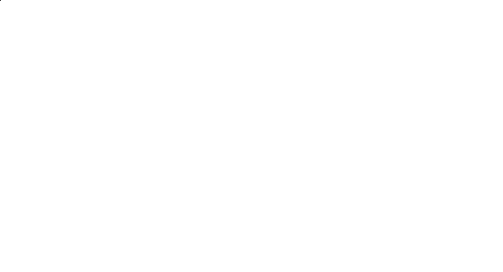
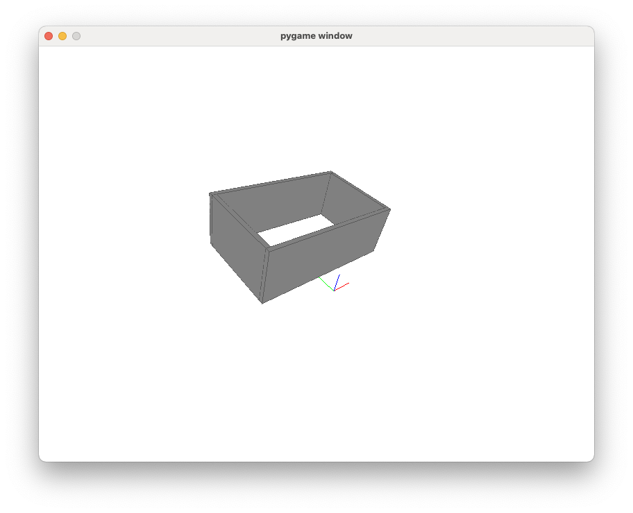
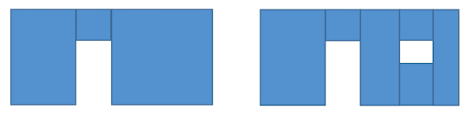
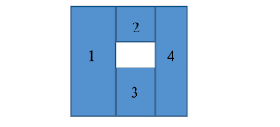
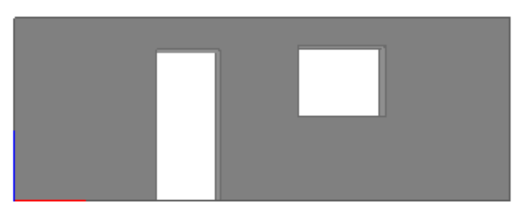
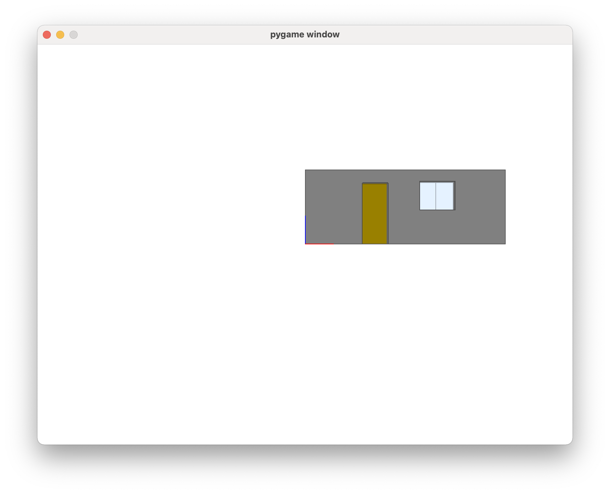

# TP3 : Représentation visuelle d'objets.

## Consignes

### Cadre

Les Tps se font par binôme (ou un monôme en cas de nombre d'étudiants impairs) afin de palier au manque de machines en salle. Cela veut dire qu'il y aura seulement un rendu par groupe. 

### Rendu

Le rendu se compose des deux éléments suivants:

* Le code complété à partir du répertoire initial qui accompagne ce sujet.
* Un rapport écrit au format word ou pdf selon le modèle disponible dans le repertoiore de travail. Ce rapport doit rendre compte du travail que vous avez effectué en présentant  pour chaque question demandé les problèmes à résoudre et la solution proposée avec une explication avec vos propres mots et enfin le résutlat obtenu (par exemple un affichage du résultat obtenu sur plusieurs exemples dans le cas d'une fonction).

Les deux éléments sont **essentiels**. En effet, avoir un code fonctionnel et répondant à l'ensemble des questions. ne suffit pas pour avoir une bonne évaluation. Le rapport permet de rendre compte que vous avez compris ce que vous faisiez. 

> Le dépôt du rendu (code + rapport) se fait sur la plateforme **Github Classroom** dont le lien est disponible sur la page moodle du cours au niveau relatif au TP3. **De plus, il faut aussi déposer uniquement le rapport** sur la zone dépot du TP3 sur la page moodle.

**Pour le code, à chaque question, on a une fonction dédiée dans le fichier main.py. Ne pas effacer les fonctions que vous avez faites avant quand vous passez à la question suivante.**

### Tests unitaires

Pour vous aider et pour la notation, des unitaires sont présents pour les questions 1 à 5 et il est nécéssaire que ceux-ci passent avant de passer à la question suivante.

La question 6 permet de finir le TP pour avoir une maison complète.

### Délai

Afin de vous laisser le temps de faire le rapport si besoin, la date limite du rendu est donnée au **soir du jour où le TP a été programmé (avant minuit)**.

## I - Présentation du TP

On s'intéresse dans ce TP à la représentation d'objets 3D à l'écran dans une fenêtre graphique qui permet des opérations de zoom, rotation est translations.  On a choisi la représentation de maisons à partir d’objets simples que l’on va construire progressivement comme les murs, les portes, les fenêtres…La figure suivante est un exemple de ce que vous pourriez obtenir à la fin de ce TP :


Afin de pouvoir parvenir à ce résultat, le travail se repose essentiellement sur deux librairies :

*  Le module *Pygame* permet, entre autres, de construire des jeux en *Python*. Pour traiter des jeux, le programme doit gérer des événements comme l’appui sur des boutons. Vous trouverez sur le lien suivant la documentation des différents objets et méthodes utilisables dans *Pygame* : https://www.pygame.org/docs/ 
	Dans le cadre du TP, nous utiliserons Pygame afin de gérer l'affichage d'une fenêtre graphique et des interactions entre celle-ci et l'utilisateur (déplacement et clicks de souris entre autres)
	**Attention : ** Nous utilisons la version 2.0.0 et non pas la dernière version en raison de problèmes de compatibilités. Si vous avez l'environnement Anaconda du cours, la version installée est la bone.
*  Le module *PyOpenGL* permet d’accéder en *Python* aux très nombreuses fonctions de visualisation de la bibliothèque OpenGL dédiée à l’affichage de scènes tridimensionnelles à partir de simples primitives géométriques. On trouvera sur le lien suivant les informations pour l’installation ainsi que le lien vers la documentation : http://pyopengl.sourceforge.net/. 
	Dans ce TP, nous utilisons PyOpenGL pour construire et afficher les objets 3D sur la fenêtre graphique.

## II - Préparation à faire avant le TP

> Il est essentiel d'avoir fait cette préparation **avant la première séance de TP3** afin de pouvoir avancer de manière concrète durant la séance en ayant des réponses à vos interrogations.

### Utilisation de Pygame

Comme indiqué précédemment, Pygame nous permet en premier lieu de générer une fenêtre d'affichage graphique avec laquelle on peut intéragir.

**(1).** Essayons d'abord un code simple. Dans spider, écrire un nouveau programme et copier-coller les lignes suivantes.

``` {code-block} python
:linenos:

import pygame
pygame.init()
ecran = pygame.display.set_mode((300, 200))
pygame.quit()
```

À l'aide de la documentation de Pygame, expliquer ces 4 lignes.
Exécuter le code. Que se passe-t-il ? 

**(2).** Il est en fait normal que la fenêtre affichée se ferme en une fraction de seconde. En effet, Pygame a considéré qu’il avait fini son travail. On ne lui a pas demandé de gérer autre chose, comme des événements (qui pourraient par exemple dire à Pygame : "attends que je clique sur la croix pour fermer ma fenêtre") !

Pour cela, il faut demander à Pygame de vérifier s’il y a des événements en cours (touche du clavier appuyée, clic souris …) et il nous faut les **traiter** par la suite pour agir en conséquence. Essayons maintenant le code suivant :

```{code-block} python
:linenos:

import pygame


pygame.init()
ecran = pygame.display.set_mode((300, 200))

continuer = True
while continuer:
    for event in pygame.event.get():
        if event.type == pygame.KEYDOWN:
            continuer = False

pygame.quit()
```

Que se passe-t-il ? Appyer sur un bouton quelconque du clavier et observez ce qu'il se passe.
Expliquer à l'aide du code et de la documentation de Pygame, comment on est parvenu à ce résultat.

Ces deux exemples permettent ainsi d'illustrer le fonctionnement de Pygame pour afficher une fenêtre dont on peut contrôler les dimensions et pour lequel on peut gérer des évènements. Au delà des touches au clavier, il est possible de gérer un grand nombre d'évènements à la souris.

### Utilisation de Pyopengl pour représenter des objets 3D

On s'intéresse maintenant dans un second temps à la représentation d'objets sur la fenêtre graphique crée par le module Pygame. Pour cela, il faut s'intéresser au principe de la projection graphique qui permet de représenter des objets 3D sur un plan 2D. Plusieurs types de projections existent mais on s'intéresse à la projection par perspective.

Le principe est de considérer un repère de coordonnées pour le quel l'observateur se situe à l'origine et regarde la scène devant lui à travers d'un écran (correspondant à l'écran de la fenêtre graphique). Un objet 3D constitué d'un grand nombre de points (appelés vertices) est alors représenté sur l'écran par un point obtenu en prenant l'intersection de la droite partant de l'oeil et allant au vertice avec l'écran. Le principe est illustré de la façon suivante :

 

Ainsi, les objets éloignés apparaissent plus petit que les objets proches. En pratique, il est courant d'utiliser ce qu'on appelle des **coordonnées homogènes** :

* Au lieu de considérer un vecteur de coordonnées $[x, y, z]^\mathrm{T}$ de dimension $3$ pour représenter la position des points sur le repères, on va définir un vecteur de dimension $4$ $[x_h, y_h, z_h, w]^\mathrm{T}$ de telle manière que la composante est une composante de normalisation, i.e on obtient $x_h$, $y_h$ et $z_h$ à partir de leur équivalent cartésien par les relations suivantes :

	$ \left\{\begin{matrix}x_h=x/w\\y_h=y/w\\z_h=z/w\end{matrix}\right. $

* L'intérêt de ce système est, entre autres, de coordonnées est de pouvoir "se balader" sur le plan de perspective en modifiant le facteur $w$, ce qui est pratique

* Pour un guide interactif de cette approche, voir par exemple :https://wordsandbuttons.online/interactive_guide_to_homogeneous_coordinates.html

OpenGl se base en particulier sur ce système de coordonées. En pratique, pas besoin de comprendre le détail du système pour pouvoir utiliser la libraire (en plus $w$ est souvent fixé à $1$), mais il faut retenir qu'i'l est parfois nécessaires d'utiliser le système de coordonnées homogènes de dimension $4$.  **Dans le cadre du TP, $w=1$ toujours.** 

Dans ce système, chaque opération de translation, rotation ou de changement d'échelle d'un point du repère se fait alors à l'aide d'une matrice de dimension $4\times 4$.  En particulier, on a:

* **Changement d'échelle :** La matrice de transformation est donnée par

	$\mathbf{M}= \begin{pmatrix}a&0&0&0\\0&b&0&0\\0&0&c&0\\0&0&0&1\end{pmatrix} $, où $a$, $b$, $c$ correspondent aux facteurs d'échelle pour chaque dimension $x$, $y$, $z$. En effet, pour un vecteur $\mathbf{v} = [x, y, z, 1]^\mathrm{T}$, on a $\mathbf{M}\mathbf{v}= [ax, by, cz, 1]^\mathrm{T}$. Cette opération est réalisée par la fonction **glScalef(a, b, c)** du module *PyOpenGL*. 

* **Translation :** La matrice de transformation est donnée par

	$M= \begin{pmatrix}1&0&0&a\\0&1&0&b\\0&0&1&c\\0&0&0&1\end{pmatrix} $, où $a$, $b$, $c$ Correspondent aux décalage à effecteur pour chaque dimension $x$, $y$, $z$. En effet, pour un vecteur $\mathbf{v} = [x, y, z, 1]^\mathrm{T}$, on a $\mathbf{M}\mathbf{v}= [a+x, b+y, c+z, 1]^\mathrm{T}$. Cette opération est réalisée par la fonction **glTranslatef(a, b, c)** du module *PyOpenGL*. 

* **Rotation :** La matrice de transformation pour une rotation autour de l'axe donné par le vecteur $[0,0,1]^\mathrm{T}$ est donnée par

	$M_{3}=\left(\begin{array}{cccc}\cos \theta & \sin \theta & 0 & 0 \\ -\sin \theta & \cos \theta & 0 & 0 \\ 0 & 0 & 1 & 0 \\ 0 & 0 & 0 & 1\end{array}\right)$ Où $\theta$ Correspond à l'angle de rotation. Ce principe se généralise pour une rotation d’un angle $\theta$ autour d’un vecteur quelconque. Cette opération est réalisée par la fonction **glRotatef0(theta, a, b, c)** du module *PyOpenGL*. 

En effectuant une opération à chaque vertice qui constitue un objet, on réalise l'opération sur l'objet 3D en entier. De plus, il est possible de faire une composition de transformation en multipliant les matrices de transformation (au sens matriciel) entre elles.

Afin d'utiliser OpenGL, il faut définir ce qu'on appelle la **matrice de perspective** qui est la transformation qui permet d'obtenir à partir d'un point quelconque, la transformation qui permet de le projeter sur le plan de l'écran et ainsi obtenir sa position sur la fenêtre graphique.  La position d'un point sur l'écran quelconque peut s'obtenir à l'aide de relations géométrique et du théorème de Thalès. A cela il faut ajouter le principe du **clipping** qui consiste à ne pas calculer la projection de tous les objets de l'espace (car trop couteux en termes de calculs) mais seulement ceux définit dans un espace 3d définit par deux angles et deux plans de la façon suivante :


**On remarquera que par convention, la zone rendue est située dans les $z$ négatifs.** La matrice de perspective est obtenue à l'aide de la fonction **gluPerspective (fovy, aspect, zNear, zFar)** du module PyOpenGL.

On a maintenant tous les éléments nécessaires pour pouvoir comprendre comment utiliser la librairie OpenGL. Passons à la pratique.

**(1).** Commençons d'abord par dire à Pygame que l'on veut utiliser OpenGL.

Pour cela, faites un nouveau fichier et coppier/coller le code suivant :

```{code-block} python
:linenos:


import pygame
import OpenGL.GL as gl
import OpenGL.GLU as glu

if __name__ == '__main__':
    pygame.init()
    display=(600,600)
    pygame.display.set_mode(display, pygame.DOUBLEBUF | pygame.OPENGL)
    
    # Sets the screen color (white)
    gl.glClearColor(1, 1, 1, 1)
    # Clears the buffers and sets DEPTH_TEST to remove hidden surfaces
    gl.glClear(gl.GL_COLOR_BUFFER_BIT | gl.GL_DEPTH_BUFFER_BIT)                  
    gl.glEnable(gl.GL_DEPTH_TEST)    
    
    # Placer ici l'utilisation de gluPerspective.

    while True:
        for event in pygame.event.get():
        	if event.type == pygame.QUIT:
        		pygame.quit()
                exit()
```

Si vous lancez le code, rien de spécial ne se passe.. Toutefois, grâce aux lignes 23-25, il est possible de fermer la fenêtre en cliquant sur la croix. De plus on a indiqué à Pygame que l'on utilise le mode OpenGL à l'aide de la ligne 11.

Il faut maintenant indiquer comment gérer la perspective en initialisant la matrice de perspective. Pour cela utiliser la fonction **gluPerspective (fovy, aspect, zNear, zFar)**. On utilisera un Field of View de $45°$ Et comme plan de clipping near la valeur $0.1$ Et le plan de clipping far, la valeur $50$. Exécuter ensuite, le fichier et voir s'il n'ya pas d'erreurs.

**(2).** Essayons maintenant de tracer des axes. Pour cela, il faut utiliser les fonctions **glBegin**, **glColor3fv** et **glVertex3fv** et enfin de la fonction **glEnd** de la manière suivante :

```{code-block} python
:linenos:

gl.glBegin(gl.GL_LINES) # Indique que l'on va commencer un trace en mode lignes (segments)
gl.glColor3fv([0, 0, 0]) # Indique la couleur du prochian segment en RGB
gl.glVertex3fv((0,0, -2)) # Premier vertice : départ de la ligne
gl.glVertex3fv((1, 1, -2)) # Deuxième vertice : fin de la ligne
gl.glEnd() # Find du tracé
pygame.display.flip() # Met à jour l'affichage de la fenêtre graphique
```

On place le vertice à la position $z=-2$ car par défaut l'écran est en  $z=0$. Lorsque l'on veut faire plusieurs tracés, pas besoin de refaire un **glBegin** et **glEnd**, on peut mettre plusieurs commandes de vetices en très le **glBegin** et le **glEnd**. OpenGL reliera les vertiges défini successivement en mode ligne.

Utiliser cet exemple pour tracer un segment pour chaque axe $x$, $y$ et $z$ en couleurs rouge, vert et bleu respectivement.

**(3).** Afin de déplacer la position de l'écran, on peut utiliser une transformation de translation. Pur cela utiliser la fonction **glTranslatef** après la fonction **gluPerspective** pour faire une translation de l'affichage de $z=-5$ Et de $y=2$. La doc de cette fonction est disponible à  l'adresse https://www.khronos.org/registry/OpenGL-Refpages/gl2.1/xhtml/glTranslate.xml.

Effectuer ensuite une rotation à l'aide de la fonction **glRotatef**, pour faire une rotation de $90°$ Autour de l'axe $x$. Afin de pouvoir observer le tracé de l'axe $z$ effectué plus tôt. La doc de cette fonction est disponible à l'adresse https://www.khronos.org/registry/OpenGL-Refpages/gl2.1/xhtml/glRotate.xml.

> ```{code-block} python
>:linenos:
>
> glu.gluPerspective(45, (display[0] / display[1]), 0.1, 50.0)
> gl.glTranslatef(0.0, 2, -5)
> gl.glRotatef(-90, 1, 0, 0)
> ```

### Découverte de l'environnement du travail du TP

Afin de pouvoir gérer tous les éléments nécessaires pour réaliser le TP (objets 3D : murs, portes et fenêtres, fenêtre graphique pygame), on décide d'organiser le code sous formes de classes de la manière suivante :

* La classe **Configuration** dans le fichier **Configuration.py** qui gère l'affichage de la fenêtre graphique avec Pygame, les évènements au clavier/souris et enfin qui gère une liste d'objets (murs, fenêtres, etc) à dessiner sur la fenêtre. Les objets sont des instances de classes à réaliser dans d'autres fichiers.
* Les classes d'objets dessiner dans les fichiers **Section.py**, **Wall.py**, **Door.py**, **Window.py** et **House.py**.
* Le ficher **main.py** est le fichier d'exécution principal pour lequel on importe la classe Configuration et à laquelle on ajoute les éléments à dessiner.

> **Pour le code, à chaque question, on a une fonction dédiée dans le fichier main.py. Ne pas effacer les fonctions que vous avez faites avant quand vous passez à la question suivante.**

**(1). a)** Ajouter à la fonction **Q1a()** la commande suivante :

``` python
return Configuration()
```

et exécuter le fichier **main.py**. Les touches « a », « z », « Z » sont utilisables. Analyser le fichiers **main.py** et **Configuration.py** de manière **précise et détaillée**, les points principaux du code et du résultat obtenu à l'écran.

**(1). b)** L’application peut être configurée à l’aide de paramètres, transmis au constructeur d’un objet de la classe *Configuration*, dans une variable de type dictionnaire. L’exemple suivant illustre la modification de la position de l’écran et la couleur de l’axe *x* par le constructeur par rapport aux paramètres par défaut : 

```python
Configuration({'screenPosition': -5, 'xAxisColor': [1, 1, 0]}).display()
```

* Analyser l'effet de cette modification.

Certains paramètres peuvent aussi être modifiés par le « setter » ***setParameter()***. L’exemple suivant illustre la modification des couleurs de l’axe *x* et de l’axe *y* à l’aide de la méthode ***setParameter()*** : 

```python
Configuration({'screenPosition': -5, 'xAxisColor': [1, 1, 0]}). \
    setParameter('xAxisColor', [1, 1, 0]). \
    setParameter('yAxisCo lor', [0,1,1]). \
    display()
```

On notera ici l’utilisation de \ pour pouvoir écrire l’instruction sur plusieurs lignes permettant ainsi une meilleure lisibilité du chaînage dans l’appel des méthodes. 

* Expliquer pourquoi le chaînage de l’appel des méthodes ***setParameter()*** et ***display()*** est possible. 
* Un traitement particulier est effectué dans le « setter » pour le paramètre ***screenPosition***. Expliquer pourquoi ce traitement particulier doit être effectué. 

**(1). c)** Ajouter **une seule instruction** à la méthode ***initializeTransformationMatrix()*** pour que l’axe *z* soit représenté verticalement sur l’écran et que l’axe *x* soit représenté horizontalement. L’axe *y* devient alors la profondeur. Garder cette transformation pour la suite.

## III- Mise en place des interactions avec l'utilisateur avec Pygame

On s'intéresse maintenant à gérer les interactions possible de notre application avec l'utilisateur à l'aide de PyGame. Tous ces éléments sont gérés dans la méthode **display** de la classe **Configuration**.

On peut notamment y trouver la fameuse boucle infinie qui permet de faire tourner l'application en permanence tant qu'on ne quitte pas l'application.

Pour gérer trois types d'évènements (au clavier ou à la souris), on appelle deux méthodes:

* **processKeyDownEvent** : pour les évènements de type appuie sur une touche du clavier
* **processMouseButtonEvent**: pour les évènements ou on clique sur un des boutons de la souris
* **processMouseMotionEvent** : pour les évènements où l'on bouge la souris

**(1). d)** La méthode **processKeyDownEvent** gère pour l'instant les touches:

* « a » : afficher ou supprimer les axes
* « z » : pour une rotation de 2.5 degrés autour de l'axe z
* « Z » : pour une rotation de -2.5 autour de l'axe z

> Dans la version 1.9.6 de Pygame, le clavier est en mode Qwerty par défaut. La constante pygame.K_a correspond donc à la touche « a » d'un clavier Qwerty, soit la touche « q » d'un clavier Azerty. Pour traiter indifféremment les claviers Qwerty et Azerty, on utilise la valeur fournie par la clé unicode du l'attribut dict associé à l'événement. La version 2.0.0 de Pygame a corrigé ce problème de clavier et la constante pygame.K_a correspond à la touche « a », quel que soit le clavier. Le code fourni gère les deux versions de Pygame. On pourra analyser la manière utilisée pour tester la touche « Z »  pour la version 2.0.0 de Pygame.

 Ajouter la gestion des touches « Page Up », « Page Down » pour, respectivement, grossir ou réduire l'affichage, c'est-à-dire effectuer un changement d'échelle (effet de zoom). **Le facteur d'échelle pour un zoom positif devra être de $1.1$  et pour un zoom négatif $1/1.1$ et ce dans les trois axes.**

 On cherchera les codes à utiliser pour ces deux touches dans la documentation de Pygame.

**(1). e)** On souhaite maintenant réaliser le changement d'échelle (effet de zoom) en utilisant la mollette de  la  souris.  On  reconnait  une  action  sur  la  souris  lorsque  le  type  de  l'événement  est MOUSEBUTTONDOWN. Le sens de l'action sur la mollette est fourni par l'attribut **button**, associé à l'événement, qui prend les valeurs 4 ou 5.

Remplacer l'instruction pass dans la méthode **processMouseButtonDownEvent()** pour gérer l'effet de zoom avec la souris.

**Le facteur d'échelle pour un zoom positif devra être de $1.1$  et pour un zoom négatif $1/1.1$ et ce dans les trois axes**


**(1). f)**  On souhaite "déplacer" les objets affichés en bougeant la souris lorsque le bouton de droite ou de gauche est activé. Le bouton de gauche servira aux rotations des objets et le bouton de droite aux translations des objets. 

On détecte l'état des boutons de la souris à l'aide de la méthode **get_pressed()** de l'objet mouse de Pygame. Cette méthode retourne un tuple qui contient respectivement l'état du bouton  de  gauche,  du  bouton  de  la  molette  et  du  bouton  de  droite.  Ainsi **pygame.mouse.get_pressed()[0]**  retourne  l'état  du  bouton  de  gauche  et **pygame.mouse.get_pressed()[2]** retourne l'état de celui de droite. Si la valeur retournée vaut 1 le bouton est enfoncé, si elle vaut 0 le bouton est relâché.

Lorsque la souris est déplacée des événements de type MOUSEMOTION sont engendrés. Pour ce type d'événement, l'attribut **rel** de l'événement fournit un tuple contenant le déplacement en x et en y de la souris. Ainsi, **self.event.rel[0]** est le déplacement en x et self.event.rel[1] le déplacement en y.

Ces déplacements relatifs seront utilisés pour engendrer :

* Une rotation autour de x composée avec une rotation autour de z lorsque le bouton gauche est
	enfoncé et que la souris est déplacée. 
* Une translation selon l'axe x composée à une translation selon l'axe z lorsque le bouton droit
	est enfoncé et que la souris est déplacée.

Remplacer l'instruction pass dans la méthode **processMouseMotionEvent()** pour gérer le déplacement des objets.

## IV - Création d'une section

On s'intéresse maintenant à la création d'une section. Une section correspond à un parallélépipède à 8 sommets et 6 faces:



Une section est constituée du dessin de ses arrêtes et du remplissage des faces par une couleur. Les paramètres d'une section sont:

* La largeur dans l'axe des x dénommée **width**
* La hauteur dans l'axe des z dénommée **height**
* La profondeur dans l'axe des y dénommée **thickness**
* La position du coin inférieur gauche à l'aide de trois coordonnées stockées dans une liste **position**

Un prototype de section est ainsi réalisé dans le ficher **section.py** et il s'agit ici de le compléter. 

Concentrons nous d'abord sur la création d'une section positionnée avec le coin inférieur gauche en $[0,0,0]^\mathrm{T}$:

**(2) .a)** En s'inspirant du fichier **Configuration.py**, écrire la méthode **generate(self)** de la classe **Section** qui crée les sommets et les faces d’une section orientée selon l’axe x et dont le coin bas gauche de la face externe est en (0, 0, 0). La figure 4 représente ce repère. Les coordonnées des sommets devront être définies en utilisant les paramètres width, height et thickness. Chaque face sera représentée par les numéros de ses quatre sommets, le numéro d’un sommet correspondant au numéro d’ordre de la définition des sommets (voir l’ébauche de la fonction generate() ci-dessous) :

```{code-block} python
:linenos:

    def generate(self):
        self.vertices = [ 
                [0, 0, 0 ], 
                [0, 0, self.parameters['height']], 
                [self.parameters['width'], 0, self.parameters['height']],
                [self.parameters['width'], 0, 0],      
				....
                ]
        self.faces = [
                [0, 3, 2, 1],
                ...
                ]   
```

**(2). b)** Le dessin d'une section se fera selon le principe de la figure 4. Les 6 faces seront remplies dans une couleur pouvant être modifiée par le constructeur de la classe ou par le « setter » setParameter(). Ces 6 faces sont traitées dans le mode prenant en compte la profondeur et permettant de ne pas afficher les parties cachées. Ce mode est activé par l'appel **glEnable(GL_DEPTH_TEST)** dans la méthode
initializeOpenGL() dans la classe Configuration.
Pour tracer une face verticale en gris dont les quatre sommets sont $[0, 0, 0], [1, 0,0], [1, 0, 1], [0, 0, 1]$, selon le repère de la figure précédente, on écrira :

```{code-block} python
:linenos:

gl.glPolygonMode(gl.GL_FRONT_AND_BACK, gl.GL_FILL) # on trace les faces : GL_FILL
gl.glBegin(gl.GL_QUADS) # Tracé d’un quadrilatère
gl.glColor3fv([0.5, 0.5, 0.5]) # Couleur gris moyen
gl.glVertex3fv([0, 0, 0])
gl.glVertex3fv([1, 0, 0])
gl.glVertex3fv([1, 0, 1])
gl.glVertex3fv([0, 0, 1])
gl.glEnd()
```

On peut ainsi tracer les 6 faces composant la section. Il est toutefois nécéssaire de gérer la position et l'orientation de celle-ci (paramètres inclus dans la classe **Section**). Pour cela, on procède en deux étapes:

* Dans un premier temps, on crée une section placée à l'origine comme dans l'exemple donné dans le code

* On considère un matrice de projection propre à la section, et qui sera relative par rapport à la matrice de projection globale de l'application. Cette matrice de projection permet alors de placer la section au bon endroit et avec la bonne orientation à l'aide d'une composition de translation et de rotation.

	Il faut donc pouvoir redéfinir une matrice de projection propre à la section sans toutefois perdre celle du repère initial. **PyOpenGL** fournit à cet effet deux fonctions ***glPushMatrix()*** et ***glPopMatrix()*** qui permettent respectivement de sauvegarder et de récupérer une matrice de transformation dans une pile. On utilise ***glPushMatrix()*** au début du traçage de la section et ***glPopMatrix()*** à la fin une fois que l'on a fini de tracer les faces.

Ainsi à l'aide de ces informations et de la documentation de **PyOpenGL**:

* Analyser la fonction **Q2b()** dans le fichier main.py et expliquer l’instruction **Configuration().add(section).display()**
* Ecrire la méthode **draw()** pour la classe **Section** afin de tracer les faces de la section en gris
* Exécuter la fonction **Q2b()** dans le main pour visualiser la section.

**(2). c)** Pour dessiner les arêtes de la section, le principe est identique à celui décrit à la question précédente. Il suffit de modifier la couleur et de changer le mode par **gl.glPolygonMode(gl.GL_FRONT_AND_BACK,gl.GL_LINE)**. Pour la couleur, on pourra, par exemple, utiliser la couleur de la section en multipliant chaque composante par un facteur inférieur à 1, ce qui assombrira la couleur.

* Ecrire la méthode **drawEdges()** dans la classe **Section.**
* Modifier la méthode draw() de la question **(2). b)** pour que la méthode **drawEdges()** soit
	exécutée en premier lorsque le paramètre **edges**, fourni au constructeur ou via le « setter »
	**setParameter()**, prend la valeur **True**.
* Exécuter la fonction **Q2c()** du fichier **main.py** pour visualiser la section avec arrêtes

## V - Création des murs

On s'intéresse maintenant à la création d'un mur. Celui-ci correspond à un objet contenant une liste d'éléments à tracer (fenêtres, portes et sections) dans notre application. Dans un premier temps, nous allons considérer qu'un mur n'est constitué que d'une seule section.

**(3). a)** 

- Analyser le fichier **Wall.py** (notamment le constructeur de la classe **Wall**) et expliquer comment cette opération est réalisée.

- Écrire ensuite dans la méthode **draw** de la classe **Wall** une suite d'instruction permettant de dessiner le mur avec ses arêtes et tous les objets contenus dans l'attribut objects.

	Notamment, on a ajouté un attribut orientation par rapport à la classe **Section** qui permet de définir un angle de rotation autour de l'axe z. Il faut donc sur le même principe que la classe **Section**, définir une matrice de projection temporaire pour faire la rotation. La translation est gérée déjà dans la classe **Section** donc il n'y a pas lieu de la gérer.

	On pourra s'inspirer de la méthode **draw()** de la classe **Configuration** qui permet l’affichage de plusieurs objets.  

- Écrire enfin dans la fonction **Q3ba** du fichier **Main.py** des instructions pour créer un mur constitué d'une section parente et le tracer.

## VI - Création d'une maison

Après avoir géré la création de murs (pour l'instant uniquement constitués d'une section parente), on va construire une maison en créant 4 instances de murs. Celle-si sera gérée par la classe **House** du fichier **House.py** 

Dans ce TP, sans perte de généralité, on se limitera à la visualisation d’une maison constituée de plusieurs murs, chaque mur pouvant contenir portes et fenêtres. La maison peut être translatée et tournée par rapport au repère de la question 1 grâce aux paramètres position et orientation pouvant être fournis par le constructeur ou le  « setter »  **setParameter()** de la classe **House**. A titre d’exemple, la figure suivante représente une maison à 4 murs qui a été translatée de –3 m selon l’axe x et 1m selon l’axe y.



* En s’inspirant de la méthode  **draw()** de la classe **Configuration**  qui permet l’affichage de
	plusieurs objets, écrire la méthode **draw()** de la classe House.
* Modifier **Q4a()** dans le fichier **Main.py** pour créer une maison, constituée de 4 murs, et la tracer.

## VII - Création d'ouvertures

L'objectif est maintenant de créer des ouvertures dans un mur pour pouvoir mettre des portes et des fenêtres. On rappelle que, pour le moment, un mur est une section. Pour créer une ouverture dans un mur, nous allons **transformer la section initiale en plusieurs sections**. 

La partie gauche de la figure suivante illustre ce principe dans lequel la section initiale a été remplacée par 3 sections pour créer l'ouverture pour une porte. La partie droite de cette figure illustre ce même principe dans lequel la section à droite de la porte a été remplacée par 4 sections pour créer l'ouverture pour une fenêtre. Ainsi, le mur qui comportait initialement une section est constitué de six sections après la création des deux ouvertures.



**(5). a)** Avant d'aborder la décomposition d'une section en plusieurs sections, on s'intéresse à la représentation graphique du contour de l'ouverture, constitué de 4 faces. La position de l'ouverture est définie par la coordonnée du coin inférieur gauche par rapport au repère de la section. Compléter la classe **Opening**, définie dans le fichier **Opening.py**, et exécuter le fichier **Main.py** avec la fonction **Q5a()** afin de produire un affichage comme celui de la figure suivante, obtenu après une légère rotation autour de l'axe z (durant l'affichage).


**(5). b)** On  va  modifier  maintenant  la  classe  **Section**  en  commençant  par  ajouter  la  méthode **canCreateOpening(self,  x**)  où  **x**  est  un  objet.  Cette  méthode  retourne  *True*  si  une  ouverture, représentée par **x**, peut être ajoutée dans la section, représentée par **self**, et *False* sinon. Cette vérification reposera sur la comparaison des informations fournies par les paramètres de position, de
largeur, de hauteur de l'ouverture avec celles fournies par les paramètres de la section.
Vérifier le bon fonctionnement de votre méthode en remplaçant exécutant dans le main la fonction **Q5b()**. Expliquer pourquoi le dernier affichage vaut False.

> Pour opening3, la position en hauteur + la hauteur de l'ouverture dépasse les 2.6 de hauteur de la section.
>

**(5). c)** On arrive ensuite à la décomposition de la section. Dans le cas général, une ouverture dans une section engendre 4 sections comme le montre la figure suivante :



Chaque section engendrée a ses propres paramètres et ses conditions d'existence. A titre d'exemple la section 1 existe si sa largeur n'est pas nulle. Sa largeur est la différence entre la position, selon l'axe x, de l'ouverture et la position, selon l'axe x, de l'origine de la section initiale. Sa hauteur et son épaisseur sont celles de la section initiale. On fera des analyses similaires pour les trois autres sections.

* Ecrire  la  méthode  **createNewSections(self,  x)**  de  la  classe  **Section**  où  **x**  est  un  objet,  par
	exemple une ouverture, porte ou une fenêtre (dont on parlera plus tard), qui retourne la liste des sections engendrées par la création de l'ouverture.
* Vérifier le bon fonctionnement de votre méthode en exécutant **Q5c1()** et puis par **Q5c2()** dans **Main.py**. L’exécution de ces fonctions devrait vous donner respectivement les représentations à gauche et à droite dans la figure suivante


**(5). d)** Comme nous venons de le voir, l'insertion d'une fenêtre ou d'une porte, et plus généralement d'un objet, dans un mur doit créer l'ouverture pour cet objet. Un mur est donc composé d'une section, si aucun objet n'est inséré, ou de plusieurs sections, si un ou plusieurs objets sont insérés. Comme chaque insertion doit se faire dans une section, avant toute insertion il est nécessaire de pouvoir retrouver, parmi toutes les sections qui composent le mur, celle dans laquelle l'insertion va se faire.
C'est le rôle de la méthode **findSection(self, x)** de la classe **Wall**.

* Quel est le rôle de la fonction enumerate() dans cette méthode ?
* Si l'on exécute le code suivant, que valent respectivement section[0] et section[1] : 

```{code-block} python
:linenos:

wall = Wall({'width':7, 'height':2.6,})
opening1 = Opening({'position': [2, 0, 0], 'width':0.9, 'height':2.15, 'thickness':0.2, 'color': [0.7, 0.7, 0.7]})
section = wall.findSection(opening1)
```

L'insertion d'un objet ***x*** dans un mur sera réalisé par la méthode ***add(self, x)*** de la classe *Wall*. Pour cela on recherchera la section dans laquelle l'insertion doit être faite, si cette section existe on supprimera la section existante de la liste des objets associés au mur et on ajoutera les nouvelles sections générées par l’insertion de l’objet. On rappelle que la méthode ***createNewSections(self, x)*** de la question précédente retourne la liste des nouvelles sections. Pour la suppression dans la liste des objets, on utilisera la méthode ***pop(i)***, où *i* est l'index dans la liste de l'élément à supprimer, tandis que l'insertion des nouvelles sections pourra être réalisée efficacement avec la méthode *extend()*.

* Ecrire la méthode ***add(self, x)***

* Vérifier votre méthode en exécutant **Q5d**() dans le fichier **Main.py**.

	Vous devriez obtenir le mur représenté à la figure suivante :



## VIII - Pour finir...

**(6).** On donne dans les fichiers **Door.py** et **Wall.py** des classes permettant de gérer les portes et les fenêtres. Analyser les classes pour comprendre leur fonctionnement et écrire dans la fonction **Q6()** du fichier **main.py** des instructions permettant d'obtenir la maison suivante :



**(7).** **Pour aller plus loin...**

Dupliquer la maison de la question **(6).** Pour avoir l'affichage du gif en intro de ce TP.
